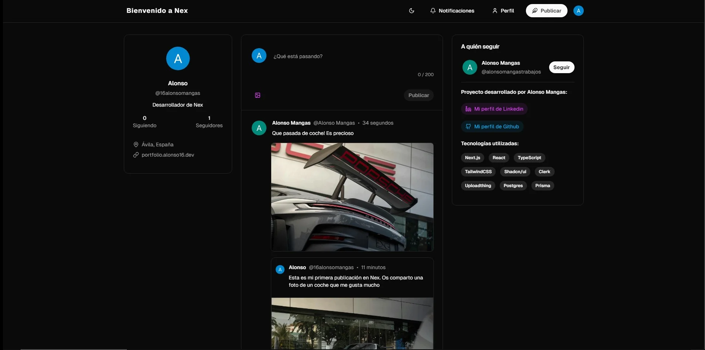

# nex

## Descripción
Bienvenido a Nex! Una red social para publicar el contenido e interactuar con otros usuarios.

Se trata de una aplicación fullstack desarrollada utilizando Nextjs. He buscado una interfaz minimalista y moderna, acompañada de una experiencia de usuario rápida e intuitiva.

## Tecnologías utilizadas

-  Stack tecnológico: Nextjs, React, TypeScript, TailwindCSS, Uploadthing, Clerk, Postgres, Prisma, Shadcn.
-  Autenticación y Autorización: Implementación utilizando Clerk.
-  Publicación de posts: Los usuarios pueden publicar contenido, tanto de manera escrita como a través de imágenes.
-  Favoritos, comentarios, compartidos y citados: Los usuarios pueden interactuar con las publicaciones de otros usuarios o con las suyas propias, ya sea dando me gusta, dejando comentarios, o compartiendo/citando dichas publicaciones.
-  Visualizar posts o reposts en una página propia dedicada a ello.
-  Notificaciones: Los usuarios pueden ver sus notificaciones en base a las interacciones que hayan tenido con su perfil o publicaciones el resto de usuarios, así como marcar como leídas las mismas de manera automatizada.
-  Edición del perfil y visualización de perfiles de otros usuarios.  
-  Despliegue en Vercel.

## Prueba la aplicación

https://nex.alonso16.dev

Agradezco mucho sugerencias!
